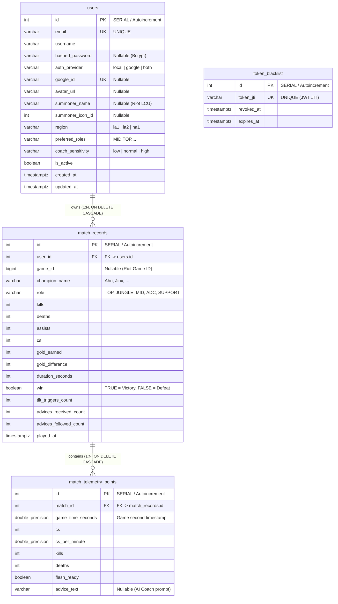

# Diagrama Entidad - Relación (ERD) - LolAnalyzer

Este documento contiene el modelo conceptual y lógico del esquema de base de datos de **LolAnalyzer** expresado en notación Mermaid interactiva.

---

## 1. Diagrama Entidad-Relación Visual (Mermaid)

---

## 2. Descripción de Cardinalidades y Reglas de Integridad

1. **`users` (1) a `match_records` (N)**:
   - Un usuario puede registrar múltiples partidas a lo largo de su historial ($0..N$).
   - Cada partida pertenece obligatoriamente a exactamente un usuario ($1..1$).
   - Regla de cascada: Si un usuario elimina su cuenta, se eliminan todas sus partidas asociadas mediante `ON DELETE CASCADE`.

2. **`match_records` (1) a `match_telemetry_points` (N)**:
   - Cada partida contiene una serie temporal de fotogramas de telemetría ($0..N$) tomados segundo a segundo o minuto a minuto.
   - Cada punto de telemetría pertenece estrictamente a una partida ($1..1$).
   - Regla de cascada: Si una partida es eliminada, todos sus puntos de telemetría se destruyen automáticamente vía `ON DELETE CASCADE`.

3. **`token_blacklist` (Entidad Independiente de Seguridad)**:
   - No mantiene claves foráneas directas para permitir la revocación inmediata sin requerir bloqueos de fila en la tabla de usuarios.
   - Mantiene una clave única (`UNIQUE`) sobre `token_jti` con un índice de alto rendimiento para validación en $O(1)$.
